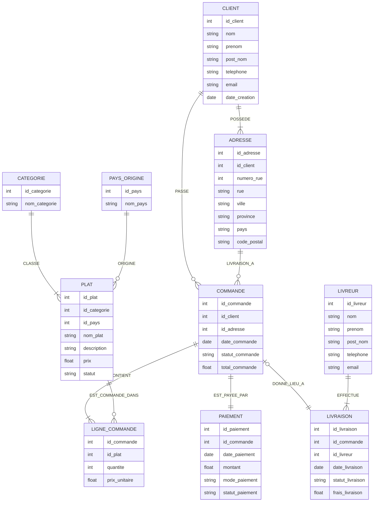

Présentation du site Mama Makusa 
 
Mama Makusa est une plateforme de vente en ligne spécialisée dans la cuisine africaine, basée à Toronto.
En lingala, Makusa signifie « cuisine », ce qui reflète l’identité du site : une cuisine africaine authentique, faite comme à la maison.

Le site permet aux clients de :

créer un compte utilisateur,

enregistrer une ou plusieurs adresses,

consulter les plats africains classés par catégorie et pays d’origine,

passer des commandes en ligne,

effectuer des paiements sécurisés,

et recevoir leurs commandes à domicile grâce à un service de livraison assuré par des livreurs.

Chaque commande est suivie à travers différents statuts (en préparation, payée, livrée, annulée), garantissant un bon suivi du processus de vente.

Mama Makusa s’adresse principalement à la communauté africaine de Toronto ainsi qu’à toute personne souhaitant découvrir la richesse de la gastronomie africaine.

