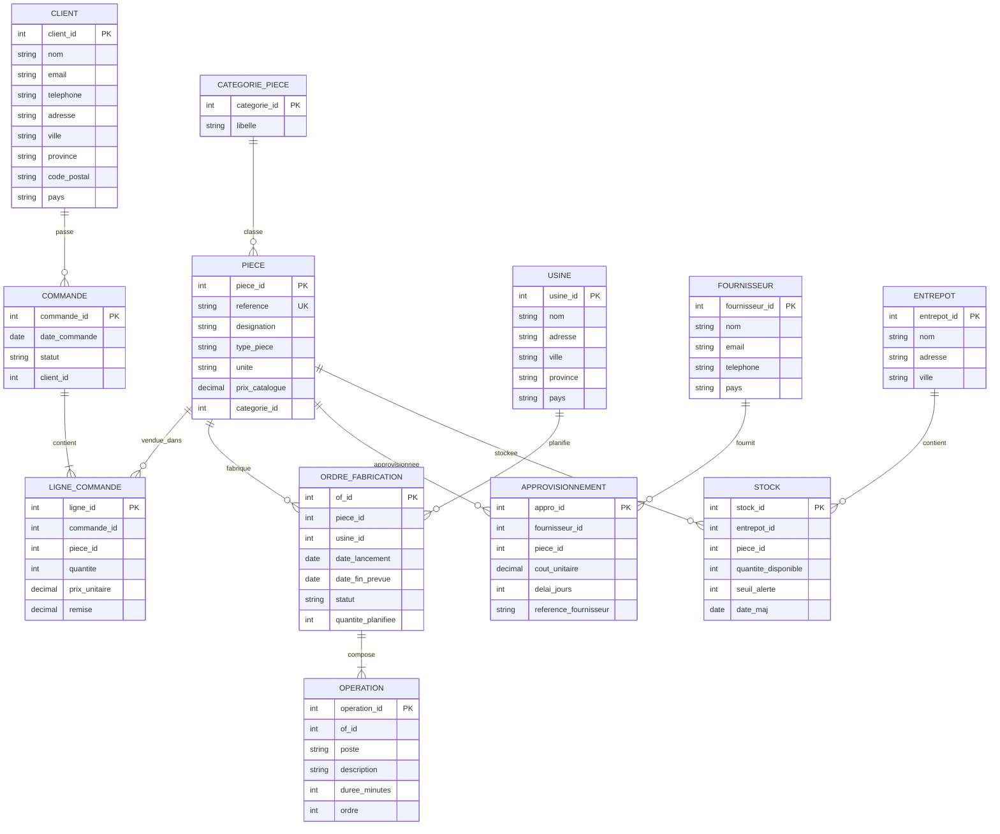

# Projet : Fabrication et vente de pièces industrielles
## Djaber Benyezza 300146667

Ce dépôt décrit un mini-schéma de base de données pour gérer **la fabrication** et **la vente** de pièces industrielles (clients, commandes, production, fournisseurs, stock).

## Contenu

- `README.md` : description + diagramme E/R (Mermaid)
- `1FN.txt` : proposition de modèle **en 1ère forme normale (1FN)**
- `2FN.txt` : passage en **2ème forme normale (2FN)**
- `3FN.txt` : passage en **3ème forme normale (3FN)**

## Diagramme E/R (Mermaid ERD)

> Copie/colle ce bloc dans un viewer Mermaid (ou GitHub) pour afficher le diagramme.

## Idée d’utilisation (SQL)

- Créer les tables à partir des entités ci-dessus
- Ajouter des contraintes (PK, FK, UNIQUE, CHECK)
- Tester des requêtes : ventes par période, stock bas, suivi des ordres de fabrication, fournisseurs par pièce, etc.
