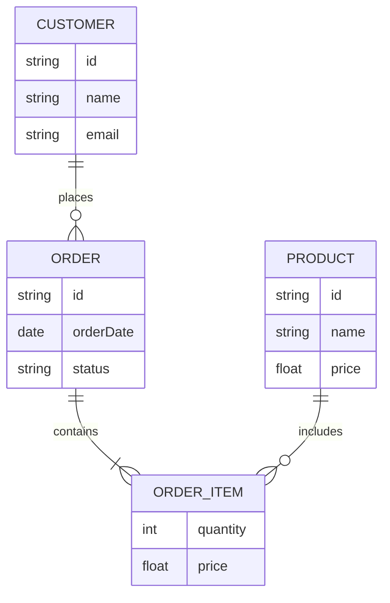

# Domaines

[:tada: Participation](.scripts/Participation.md)

## Instructions

* un `README.md`
* 3 fichiers:
 - 1FN.txt
 - 2FN.txt
 - 3FN.txt     

Diagramme E/R

```mermaid
erDiagram
    CUSTOMER ||--o{ ORDER : places
    ORDER ||--|{ ORDER_ITEM : contains
    PRODUCT ||--o{ ORDER_ITEM : includes
    CUSTOMER {
        string id
        string name
        string email
    }
    ORDER {
        string id
        date orderDate
        string status
    }
    PRODUCT {
        string id
        string name
        float price
    }
    ORDER_ITEM {
        int quantity
        float price
    }
```
