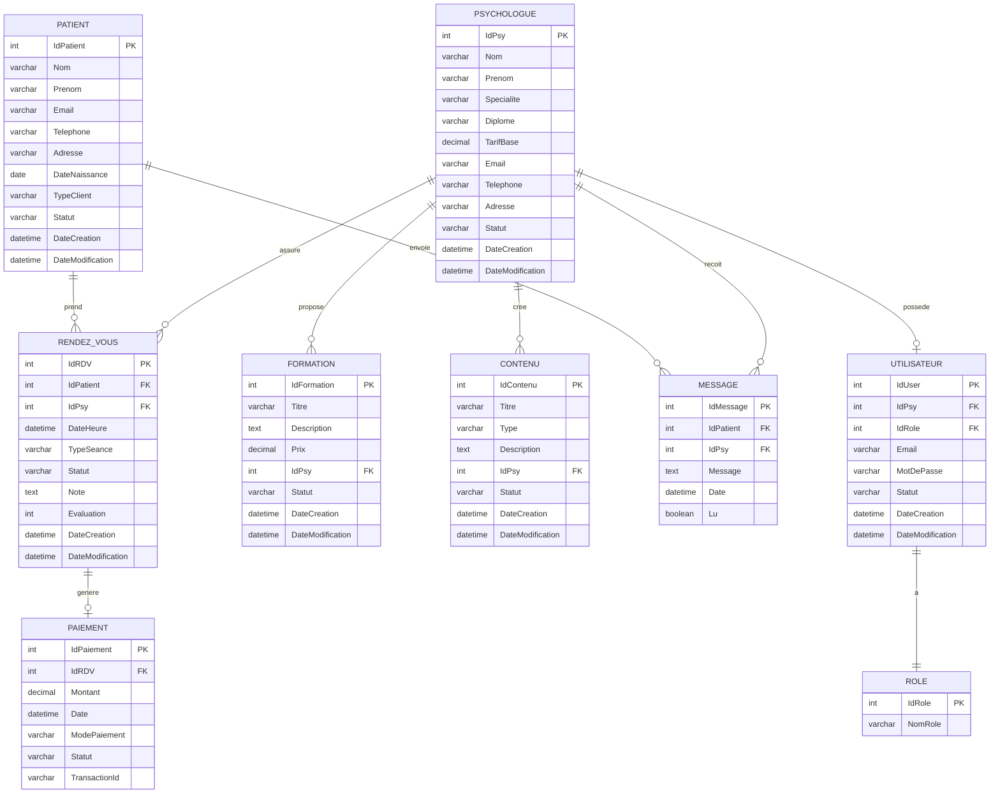

# Projet de Gestion de Cabinet de Psychologie

## 1. Choix du Domaine
Le domaine choisi est la **gestion d'un cabinet de psychologie**. Ce système permet de modéliser l'ensemble du processus de prise en charge des patients, depuis la prise de rendez-vous jusqu'au paiement des séances, en passant par la gestion des psychologues, des formations et du contenu thérapeutique.

---

## 2. Normalisation

### Fichier 1 : 1FN (Première Forme Normale)
Dans cette phase, toutes les données sont regroupées dans une structure plate ("Flat Table"). Chaque attribut est atomique. **Il n'y a pas encore d'ID techniques.**

**Attributs :**
> Patient_Nom, Patient_Prenom, Patient_Email, Patient_Telephone, Patient_Adresse, Patient_DateNaissance, Patient_TypeClient, Patient_Statut, Psy_Nom, Psy_Prenom, Psy_Specialite, Psy_Diplome, Psy_TarifBase, Psy_Email, Psy_Telephone, Psy_Adresse, RDV_DateHeure, RDV_TypeSeance, RDV_Statut, RDV_Note, RDV_Evaluation, Paiement_Montant, Paiement_Date, Paiement_ModePaiement, Paiement_Statut, Paiement_TransactionId, Formation_Titre, Formation_Description, Formation_Prix, Contenu_Titre, Contenu_Type, Contenu_Description, Message_Texte, Message_Date, Message_Lu, User_Email, User_MotDePasse, Role_NomRole

---

### Fichier 2 : 2FN (Deuxième Forme Normale)
Définition des relations et des cardinalités. On sépare les entités pour éviter les redondances partielles.

* **PATIENT (0,N)** —— PREND —— **(1,1) RENDEZ-VOUS**
* **PSYCHOLOGUE (1,N)** —— ASSURE —— **(1,1) RENDEZ-VOUS**
* **RENDEZ-VOUS (0,1)** —— GÉNÈRE —— **(1,1) PAIEMENT**
* **PSYCHOLOGUE (1,N)** —— PROPOSE —— **(1,1) FORMATION**
* **PSYCHOLOGUE (1,N)** —— CRÉE —— **(1,1) CONTENU**
* **PATIENT (0,N)** —— ENVOIE —— **(1,1) MESSAGE**
* **PSYCHOLOGUE (0,N)** —— REÇOIT —— **(1,1) MESSAGE**
* **PSYCHOLOGUE (0,1)** —— POSSÈDE —— **(1,1) UTILISATEUR**
* **UTILISATEUR (1,1)** —— A —— **(1,1) ROLE**

---

### Fichier 3 : 3FN (Troisième Forme Normale)
Structure finale. Les dépendances transitives sont éliminées. Introduction des **Clés Primaires (ID)** et des **Clés Étrangères (#)**.

* **Patient** (**IdPatient**, Nom, Prenom, Email, Telephone, Adresse, DateNaissance, TypeClient, Statut, DateCreation, DateModification)
* **Psychologue** (**IdPsy**, Nom, Prenom, Specialite, Diplome, TarifBase, Email, Telephone, Adresse, Statut, DateCreation, DateModification)
* **RendezVous** (**IdRDV**, DateHeure, TypeSeance, Statut, Note, Evaluation, DateCreation, DateModification, **#IdPatient**, **#IdPsy**)
* **Paiement** (**IdPaiement**, Montant, Date, ModePaiement, Statut, TransactionId, **#IdRDV**)
* **Formation** (**IdFormation**, Titre, Description, Prix, Statut, DateCreation, DateModification, **#IdPsy**)
* **Contenu** (**IdContenu**, Titre, Type, Description, Statut, DateCreation, DateModification, **#IdPsy**)
* **Message** (**IdMessage**, Message, Date, Lu, **#IdPatient**, **#IdPsy**)
* **Role** (**IdRole**, NomRole)
* **Utilisateur** (**IdUser**, Email, MotDePasse, Statut, DateCreation, DateModification, **#IdPsy**, **#IdRole**)

---

## 3. Diagramme ER (Mermaid)

---

## 4. Description des Entités

### Patient
Représente les clients du cabinet qui consultent les psychologues.
- **Attributs principaux** : Nom, Prénom, coordonnées de contact
- **Attributs métier** : TypeClient (individuel, couple, famille), Statut (actif, inactif)

### Psychologue
Représente les professionnels qui assurent les consultations.
- **Attributs principaux** : Nom, Prénom, Spécialité, Diplôme
- **Attributs métier** : TarifBase pour les consultations

### RendezVous
Gère les séances entre patients et psychologues.
- **Attributs principaux** : DateHeure, TypeSeance
- **Attributs métier** : Statut (planifié, confirmé, annulé, complété), Évaluation (1-5)

### Paiement
Enregistre les transactions financières liées aux rendez-vous.
- **Attributs principaux** : Montant, Date, ModePaiement
- **Attributs métier** : TransactionId pour le suivi des paiements en ligne

### Formation
Permet aux psychologues de proposer des formations.
- **Attributs principaux** : Titre, Description, Prix

### Contenu
Gère les ressources thérapeutiques créées par les psychologues.
- **Attributs principaux** : Titre, Type (article, vidéo, exercice), Description

### Message
Facilite la communication entre patients et psychologues.
- **Attributs principaux** : Message, Date, Lu (statut de lecture)

### Utilisateur & Role
Gère l'authentification et les permissions d'accès au système.
- **Roles possibles** : Admin, Psychologue, Réceptionniste

---

## 5. Règles de Gestion

1. Un patient peut prendre plusieurs rendez-vous, mais un rendez-vous concerne un seul patient
2. Un psychologue peut avoir plusieurs rendez-vous, mais un rendez-vous est assuré par un seul psychologue
3. Un rendez-vous peut générer un seul paiement
4. Un psychologue peut proposer plusieurs formations et créer plusieurs contenus
5. Les messages peuvent être échangés entre patients et psychologues
6. Chaque psychologue peut avoir un compte utilisateur avec un rôle spécifique
7. Les rendez-vous peuvent être évalués par les patients (note de 1 à 5)
8. Les paiements sont traçables via un TransactionId unique

---

## 6. Technologies Suggérées

- **Base de données** : MySQL / PostgreSQL
- **Backend** : Node.js / PHP / Python
- **Frontend** : React / Vue.js / Angular
- **Authentification** : JWT / OAuth
- **Paiement** : Stripe / PayPal API

---

## 7. Fonctionnalités Principales

- Gestion des patients et de leurs dossiers
- Prise de rendez-vous en ligne
- Gestion de l'agenda des psychologues
- Facturation et suivi des paiements
- Messagerie sécurisée patient-psychologue
- Catalogue de formations
- Bibliothèque de contenus thérapeutiques
- Système de rôles et permissions
- Historique des consultations et évaluations

---

