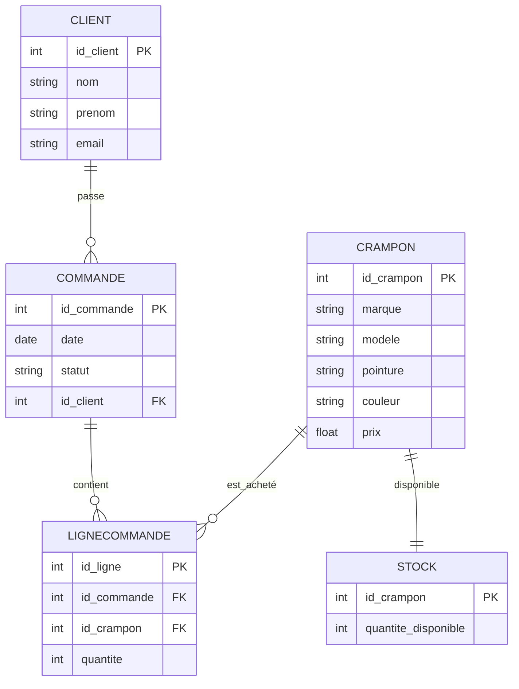

**Projet: Gestion de la vente de crampons ⚽👟**

```Powershell
Description du projet
```
Ce projet consiste à modéliser un système de vente de crampons de football. L’objectif est de gérer de manière simple et efficace les clients, les produits (crampons) et les commandes passées, tout en pouvant suivre le stock disponible.

Le système est conçu pour être clair et pédagogique, idéal pour un cours de base de données. Il ne gère pas les paiements complexes ni la livraison, afin de se concentrer sur la structure des données et les relations entre les entités.
```Powershell
Objectifs
```
Enregistrer les clients et leurs informations de contact.

Suivre les crampons disponibles et leurs caractéristiques (marque, modèle, pointure, couleur, prix).

Gérer les commandes passées par les clients, avec la possibilité de détailler chaque crampon commandé et sa quantité.

Maintenir un suivi du stock pour chaque crampon afin de connaître les quantités disponibles.
```Powershell
Entités principales
```
Client : représente une personne qui achète des crampons.

Crampon : représente un modèle de crampons disponible à la vente.

Commande : représente un achat effectué par un client.

LigneCommande : permet de détailler chaque crampon dans une commande et sa quantité.

Stock : représente la disponibilité des crampons en magasin.
```Powershell
Relations principales
```
Un client peut passer plusieurs commandes.

Une commande peut contenir plusieurs crampons différents.

Un crampon peut apparaître dans plusieurs commandes.

Chaque crampon possède un stock associé pour suivre sa disponibilité


**Diagramme E/R**


