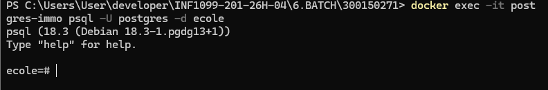

# 🧪 Lab 6 — Automatisation PostgreSQL avec PowerShell & Docker

> **INF1099 — Bases de données**
> Étudiant : **Mazigh Bareche**
> Matricule : **300150271**

---

## 📋 Table des matières

* 🎯 Objectif
* 🛠 Technologies
* 📁 Structure du projet
* 🐳 Mise en place
* ⚙️ Script PowerShell
* 📊 Vérification des données
* 📸 Captures
* ✅ Résultats

---

## 🎯 Objectif

Ce laboratoire consiste à automatiser le déploiement d’une base de données **PostgreSQL** à l’aide d’un script **PowerShell**, exécuté dans un conteneur **Docker**.

Les scripts SQL sont exécutés dans l’ordre suivant :

```
DDL → DML → DCL → DQL
```

| Étape | Fichier | Rôle                     |
| ----- | ------- | ------------------------ |
| 1️⃣   | DDL.sql | Création des tables      |
| 2️⃣   | DML.sql | Insertion des données    |
| 3️⃣   | DCL.sql | Gestion des utilisateurs |
| 4️⃣   | DQL.sql | Vérification des données |

---

## 🛠 Technologies

* 🐳 Docker
* 🐘 PostgreSQL
* 💻 PowerShell
* 🧾 SQL

---

## 📁 Structure du projet

```
6.BATCH/
└── 300150271/
    ├── DDL.sql
    ├── DML.sql
    ├── DCL.sql
    ├── DQL.sql
    ├── load-db.ps1
    └── images/
```

🖼️ Capture — Structure du projet


---

## 🐳 Mise en place

### 1. Lancer PostgreSQL avec Docker

```powershell
docker run -d --name postgres-immo -e POSTGRES_PASSWORD=postgres -e POSTGRES_DB=ecole -p 5432:5432 postgres
```

### 2. Vérifier le conteneur

```powershell
docker ps
```

🖼️ Capture — Docker actif


---

## ⚙️ Script PowerShell

Le script `load-db.ps1` permet d’exécuter automatiquement tous les fichiers SQL.

### Exécution

```powershell
.\load-db.ps1
```

🖼️ Capture — Exécution du script


---

## 📊 Vérification des données

Connexion à PostgreSQL :

```powershell
docker exec -it postgres-immo psql -U postgres -d ecole
```

Requête :

```sql
SELECT * FROM client;
```

🖼️ Capture — Résultat PostgreSQL


---

## 📸 Captures

* Structure du projet
* Docker actif
* Exécution du script
* Résultat PostgreSQL

---

## ✅ Résultats

* ✔ Tables créées
* ✔ Données insérées
* ✔ Permissions appliquées
* ✔ Script automatisé
* ✔ Résultat validé

---

## 🏁 Conclusion

Ce laboratoire montre comment automatiser complètement la création et l’utilisation d’une base de données PostgreSQL avec Docker et PowerShell.

Cette approche permet :

* d’éviter les erreurs manuelles
* d’automatiser les tâches
* de gagner du temps

---

## 👨‍🎓 Auteur

**Mazigh Bareche**
INF1099 — Bases de données
